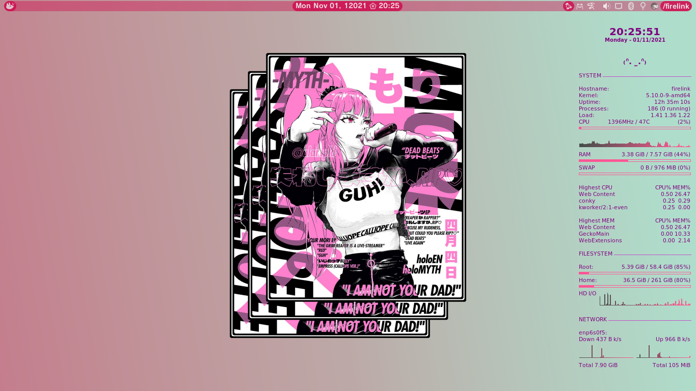
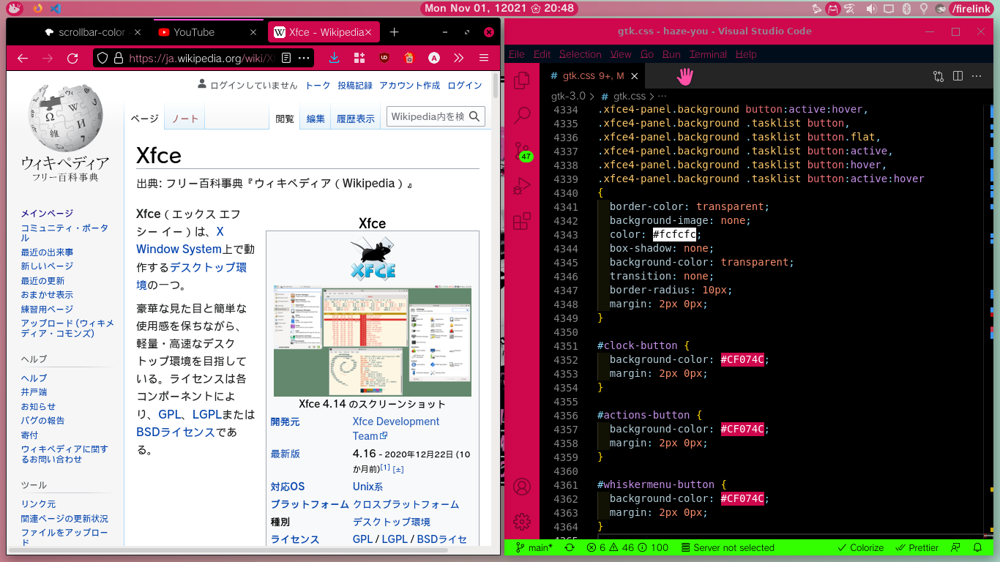
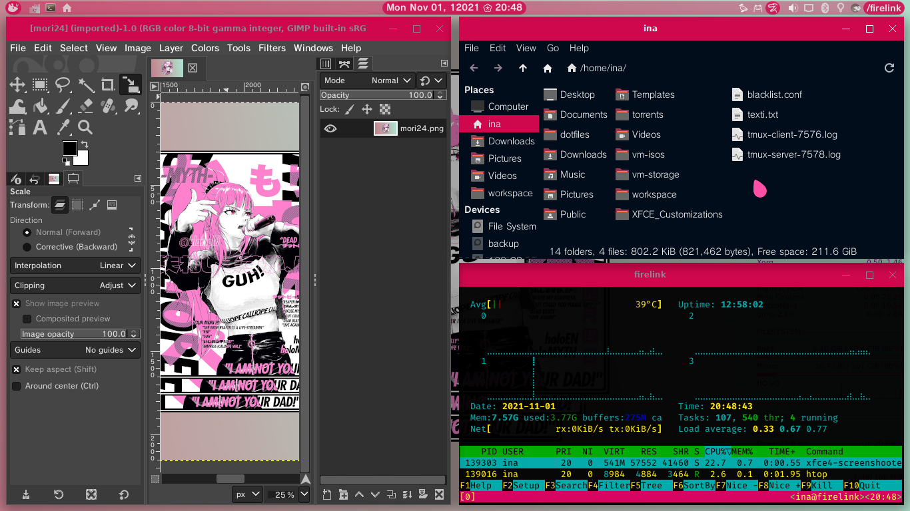
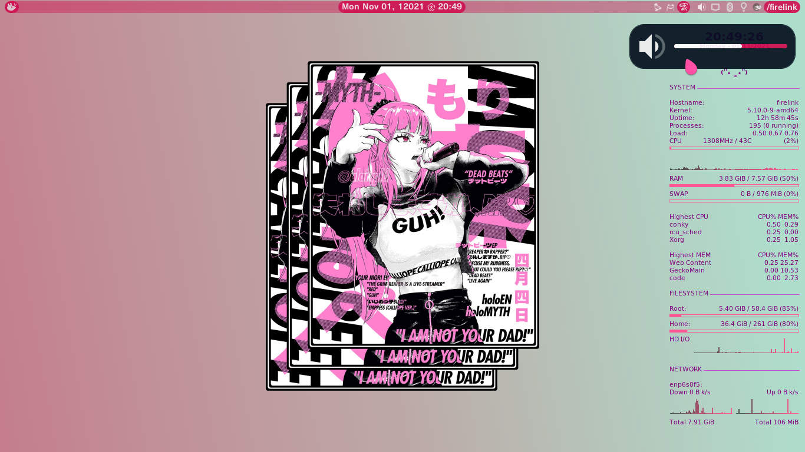
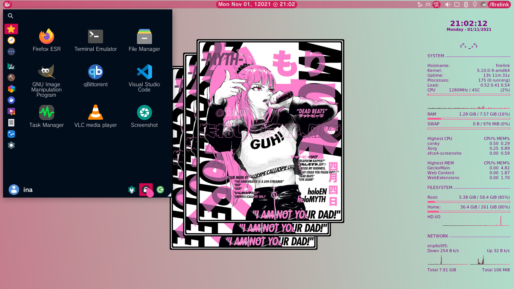
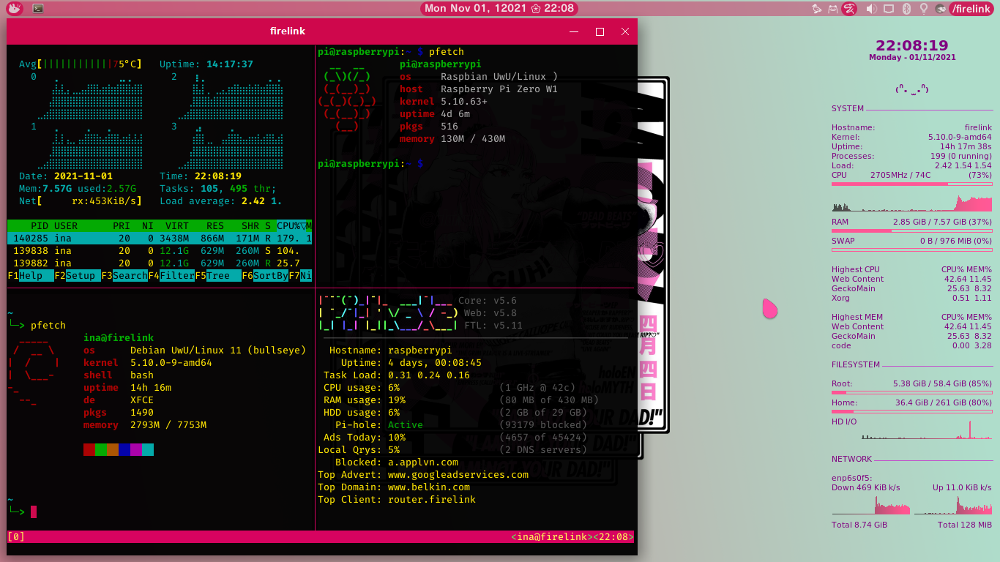

# *Haze You!*
### Overview
This is a XFCE/gtk3 theme. It was build upon the Sakura-Dark theme, with additional apps customized and *gaps* between windows.
### About *gaps*
This theme only handles the inner gaps between windows, to add gaps to the outer line you must manually add in XFCE settings, go to:
	settings manager > Workspaces > Margins
In the screenshots the margins used is 3px on every side.
### How to install?
`git clone https://github.com/inatagan/haze-you.git ~/.themes`
### Preview
#### Desktop

#### Firefox && code

#### GIMP && Thunar && Sakura terminal

#### Notifications

#### Whisker menu

#### System info

### XFCE Panel && keybindings
Copy the panel config file to its default destination

`cp -i ~/.themes/haze-you/xfce-perchannel-xml/xfce4-panel.xml ~/.config/xfce4/xfconf/xfce-perchannel-xml/`

The panel uses a custom background, currently the background provided fits a screen with 1366px width, if you want the panel to look the same on a bigger screen you will need to edit/create a custom background to fit such screen. To set the background go to the panel settings, chose panel 1 > in the appearance tab set Style to Background image and chose the appropriate file, the bg image should be in `~/.themes/haze-you/panel-background/`

Copy the keyboard shortcuts file if you want the same keybindings as well to `~/.config/xfce4/xfconf/xfce-perchannel-xml/`

`cp -i ~/.themes/haze-you/xfce-perchannel-xml/xfce4-keyboard-shortcuts.xml ~/.config/xfce4/xfconf/xfce-perchannel-xml/`

Some of the Keybindings are:

* `Super Key + W = Browser(Firefox)`

* `Super Key + F = File Manager(Thunar)`

* `Super Key + T = Tearminal`

* `Super Key + C = Code`

* `Alt + F2 = Appfinder (Compact)`

* `Alt + F3 = Appfinder (Extended)`

* `Alt + F4 = Close current window`

* `Alt + F9 = Minimize current window`

* `Alt + F10 = Maximize current window`

XFWM provide minimal tiling functions, that are arranged as a grid with the following keybindings:

Super Key +
#|Left | Full side | Right
:---:|:---:|:---:|:---:
Top|7|8|9
Full side|U|null|O
Bottom|J|K|L

### Wallpapers
The main wallpaper was made using [this art as source](https://twitter.com/AlainPLD/status/1453263612835942406/photo/1) by @AlainPLD.
### Software shown and additional themes
Firefox theme [**sakura-dark-theme**](https://addons.mozilla.org/en-US/firefox/addon/sakura-dark-theme/)

Code theme [**sakura-dark**](https://marketplace.visualstudio.com/items?itemName=inatagan.sakura-dark-vscode-theme)

Icons theme [**Papirus**](https://github.com/PapirusDevelopmentTeam/papirus-icon-theme) + [yaru folders](https://github.com/PapirusDevelopmentTeam/papirus-folders)

Mouse cursor theme [**Oreo spark pink**](https://github.com/varlesh/oreo-cursors)
<!-- accent colors {
	ff80cd
	afddcb
} -->
